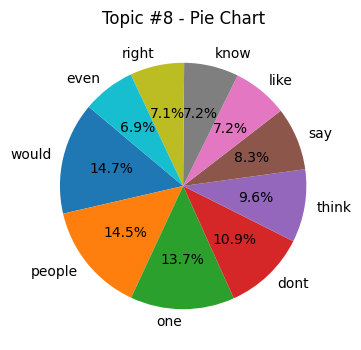
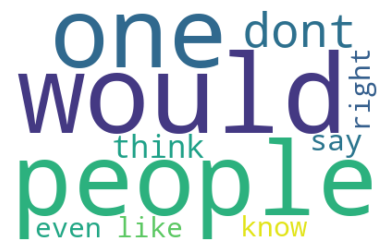
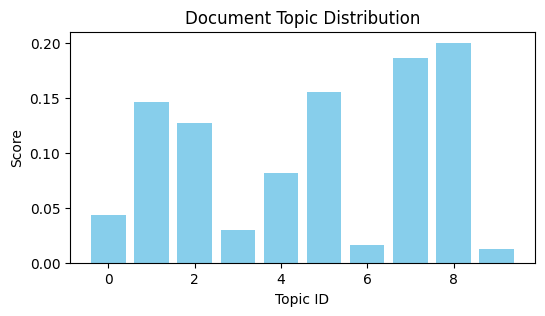
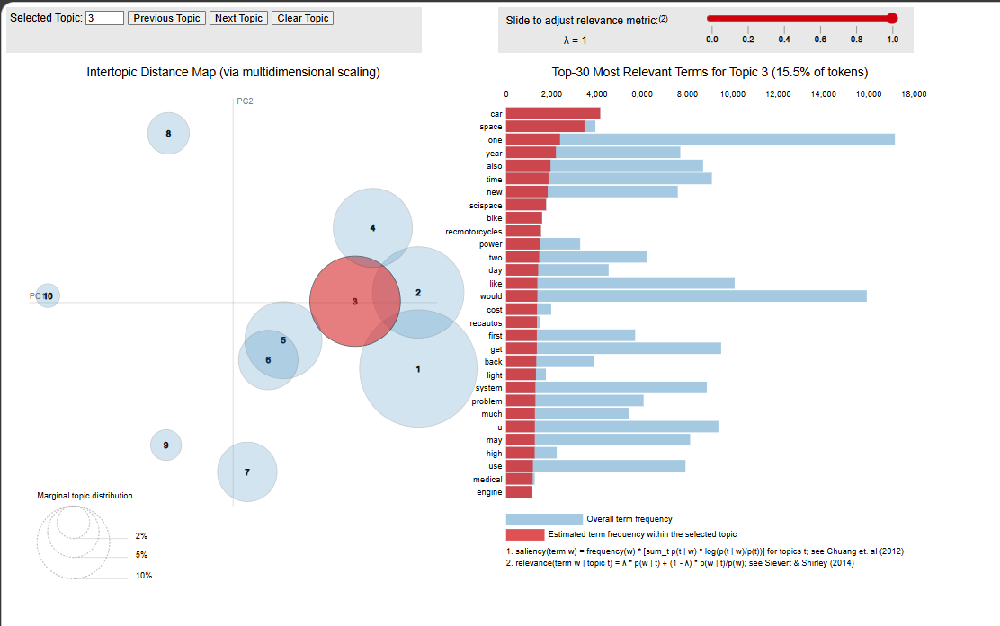
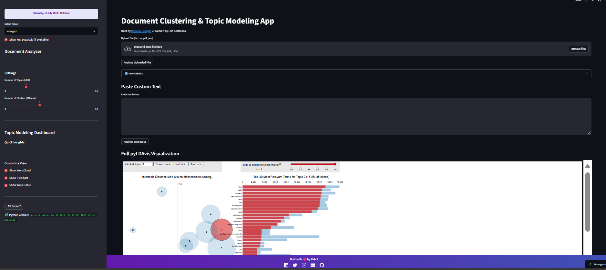

##  NLP Topic Modeling & Clustering Web App (LDA + KMeans)

An interactive NLP-based system that performs document **topic modeling** (using LDA) and **clustering** (using KMeans) with visual insights and real-time prediction using a **Streamlit web app**.

---

## 🚀 Try the Live App

👉 [Launch Streamlit App](https://topic-modeler-rahhulneurobyte.streamlit.app/)

> Upload a document (TXT, PDF, CSV, JSON) or paste custom text and get topic predictions, word clouds, and topic distributions instantly.

---

## 📌 Key Features

- ✅ **Topic Modeling** via Gensim LDA
- ✅ **Clustering** via Scikit-learn KMeans
- ✅ **Auto Tuning** using coherence & silhouette scores
- ✅ **Interactive Streamlit UI**
- ✅ **pyLDAvis Visualizations**
- ✅ **Downloadable Charts & Graphs**
- ✅ Supports `txt`, `pdf`, `csv`, `json` files

---

```
## 📂 Project Structure Overview

├── .devcontainer/               # Development container configurations (optional for cloud IDEs)
├── .streamlit/                 # Streamlit deployment configuration (app and settings)
├── config/                     # Configuration files for model or Streamlit
├── data/                       # Raw data used for processing and model training
├── models/                     # Saved models or related files
├── processed_data/             # Cleaned and preprocessed datasets (e.g., .pkl files)
├── results/                    # Evaluation results or output visualizations
│
├── app.py                      # Main Streamlit application file
├── main.ipynb                  # Jupyter notebook for data exploration or testing
├── data_ingestion_preprocessing.py  # Script for loading and preprocessing data
├── preprocessing.py            # Preprocessing pipeline
├── evaluation_tuning.py        # Model evaluation and hyperparameter tuning
├── generate_gensim_data.py     # Generate topic modeling input for Gensim
├── pyLDAvis_generator.py       # Generate pyLDAvis visualization
├── model_training.py           # Model training pipeline
├── pipeline_export.py          # Export trained pipeline
├── tune_model.py               # Tuning models
├── utils.py                    # Utility functions
│
├── filtered_topic.csv          # Clean topic-based CSV dataset
├── packages.txt                # Package list for deployment
├── requirements.txt            # Python dependency list
├── runtime.txt                 # Runtime environment (Python version)
├── pyproject.toml              # Build configuration
├── LICENSE                     # Project license (GPL-3.0)
├── .gitignore                  # Files/folders to ignore in git
└── README.md                   # You are Here!

```
---

## 🧪 How It Works

### 1. **Data Preprocessing**
- Clean, lemmatize, tokenize raw text using `data_ingestion_preprocessing.py`

### 2. **Model Training**
- Train base LDA and KMeans models
- Save vectorizers and pipelines

### 3. **Auto Tuning**
- Tune models for best coherence/silhouette scores
- Store top models and export visuals

### 4. **Visualize & Predict**
- Load models via Streamlit
- Upload text, get predicted topic, keywords, and topic score
- View Word Clouds and Pie Charts

---

## 🖼 Sample Visualizations

- 📊 Pie chart of topic keyword distribution  


- ☁️ Word cloud of top keywords
  


- 📈 Topic score graph for each input
  


- 🔍 pyLDAvis: Inter-topic distances (HTML)
  


- 🌐 Website Visualisation
 


---

## ⚙️ Run Locally

git clone https://github.com/RahulNeuroByte/Topic-Modeler.git
cd Topic-Modeler
pip install -r requirements.txt
streamlit run app.py

---


## 🧾 Input File Support

File Type	Description
.txt	Plain text file
.pdf	Extracts full text using PyMuPDF
.csv	Uses first object-type text column
.json	Extracts first string-based array/column

---

## 📊 Model Performance

| Dataset         | Best #Topics (LDA) | c\_v Score | u\_mass Score | Best K (KMeans) | Silhouette Score |
| --------------- | ------------------ | ---------- | ------------- | --------------- | ---------------- |
| 20 Newsgroups   | 20                 | 0.65       | -1.66         | 20              | 0.41             |
| Mini Newsgroups | 10                 | 0.69       | -1.45         | 10              | 0.48             |
| Merged          | 25                 | 0.66       | -1.52         | 25              | 0.52             |


---

## 📁 Plots and scores are saved in results/

🛠 Tech Stack
🧠 Gensim

🤖 Scikit-learn

📊 PyLDAvis, Matplotlib, WordCloud

🌐 Streamlit

📚 NLTK, spaCy

📝 20 Newsgroups Dataset

---

## 🙌 Author

Hi, I’m [**Rahul Kumar Dubey**]👋 —  **Data Science Intern at Celebal Technologies**.  
I’m deeply interested in **AI, Machine Learning, NLP**, and building scalable solutions to real-world problems.

This project was developed as part of my continuous journey to deepen my technical skills, explore real-world applications, and contribute to impactful innovations.

📌 *Actively seeking internships and collaborative opportunities in AI/Data Science.*  
🚀 *Open to contributions — feel free to raise an issue or submit a pull request.*

🔗 [LinkedIn](https://www.linkedin.com/in/rahulkumardubey) | [GitHub](https://github.com/RahulNeuroByte) | [Twitter/X](https://x.com/rahuldubey0129?t=j4IEIfiTFQ7eUN6-WeXCzQ&s=09)


---

✅ **Future Improvements**

- Human-readable topic labeling

- Support for BERTopic / Top2Vec

- API-based access via FastAPI

- Feedback loop to refine topic clusters


---

## ✅ Conclusion

This project brings together the power of topic modeling and clustering into an intuitive and interactive interface using Streamlit. It's ideal for NLP researchers, students, and professionals who want quick insights from raw text. 

Explore the live app, clone the repo, and feel free to contribute or suggest improvements!

---
